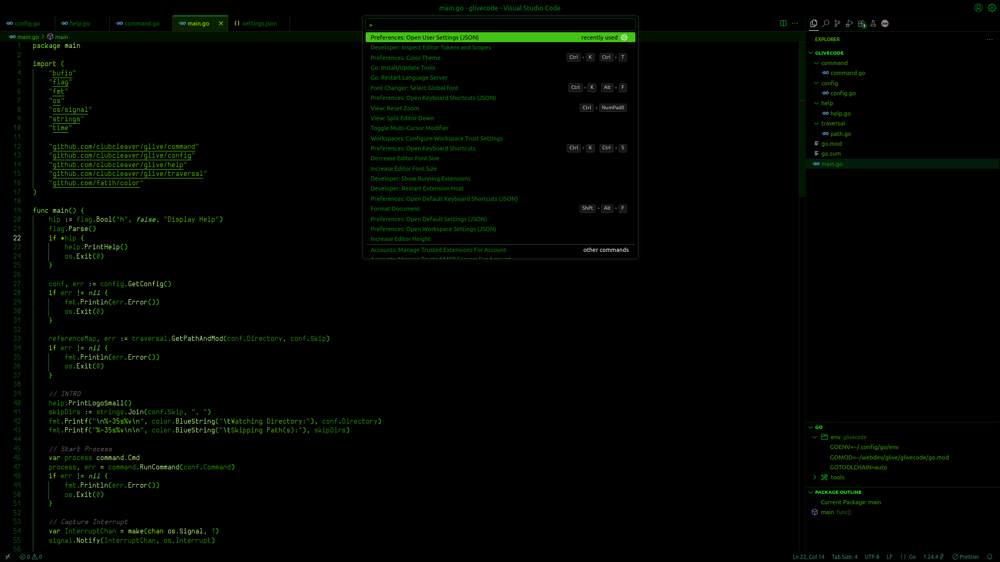
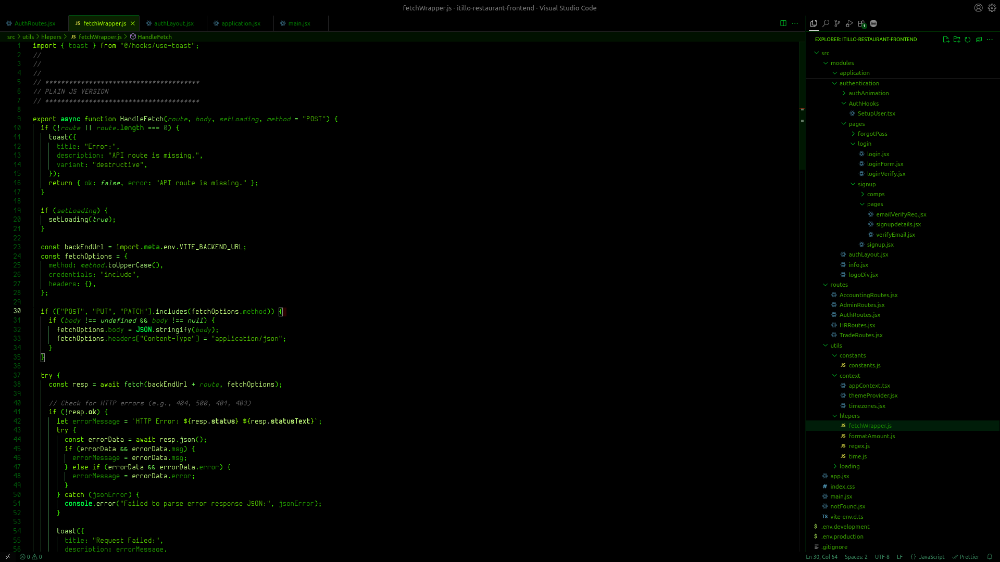
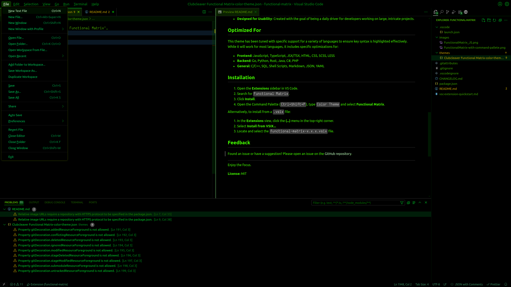

# functional-matrix README

A usable, Matrix-inspired VS Code theme for focused developers.

---

## The Philosophy

Functional Matrix is a dark, monochromatic green theme inspired by the iconic digital rain of _The Matrix_.

Unlike purely aesthetic themes, Functional Matrix is built for **productivity and long-term usability**, especially on large codebases and complex projects. It uses a consistent green color palette to reduce visual noise and help you stay in the flow.

The design philosophy is simple: keep the core code clean and uniform, but make the most important architectural elements stand out. To achieve this, comments are rendered in a distinct gray to push them to the background, while the syntax highlighting is specifically tuned to make key constructs pop:

- **Function Calls**
- **Keywords & Control Flow**
- **Type Definitions**

The result is a theme that is both stylish and highly practical, allowing you to easily write complex code while maintaining focus.

## Key Features

- **Monochromatic Green Palette**: A single-hue color scheme that's easy on the eyes and minimizes distraction.
- **High-Contrast Comments**: Gray comments provide clear separation from the functional code, letting you focus on what's executing.
- **Optimized for Key Constructs**: Syntax rules are tailored to draw your attention to the most important parts of your code.
- **Designed for Usability**: Created with the goal of being a daily driver for developers working on large, intricate projects.

## Optimized For

This theme has been tuned with specific support for a variety of languages to ensure key syntax is highlighted effectively. While it will work for most languages, it includes specific optimizations for:

- **Frontend:** JavaScript, TypeScript, JSX/TSX, HTML, CSS, SCSS, LESS
- **Backend:** Go, Python, Rust, Java, C#, PHP
- **General:** C/C++, SQL, Shell Scripts, Markdown, JSON, YAML

## Installation

1.  Open the **Extensions** sidebar in VS Code.
2.  Search for `Functional Matrix`.
3.  Click **Install**.
4.  Open the Command Palette (`Ctrl+Shift+P`), type `Color Theme` and select **Functional Matrix**.

Alternatively, to install from a `.vsix` file:

1.  In the **Extensions** view, click the **(...)** menu in the top-right corner.
2.  Select **Install from VSIX...**
3.  Locate and select the `functional-matrix-x.x.x.vsix` file.

## Feedback

Found an issue or have a suggestion? Please open an issue on the [GitHub repository](https://github.com/clubcleaver/functional-matrix).

---

Enjoy the focus.

**License:** MIT
